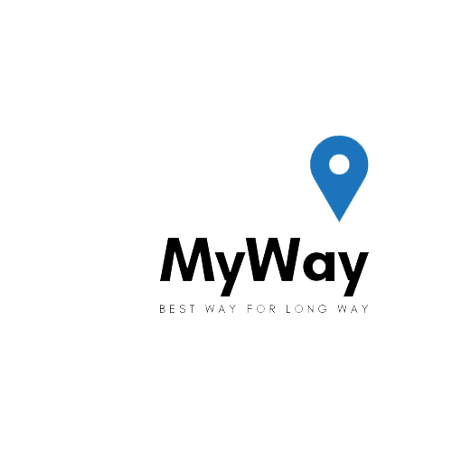

# MyWay

**MyWay** is an app that makes the driving safe for long way drivers especially truck and bus drivers. The main problem was focusing to the way or traffic. If the driver think about route, he/she can be distracted. He/she must concentrate on traffic. The best helper for this problem is MyWay.

### What Does Do MyWay?

**MyWay** connects to the car and get some informations about fuel level, tire pressure and times of driving. If fuel is running out or tire pressure is decreasing, **MyWay** will warn the driver and automatically find the best route to gas station or car services. On the other hand, **MyWay** wants you to have high quality driving. So if you are driving car for hours, it will warn you to stop and rest or eat something. Also it will find best routes to the nearest restaurants and some places to rest.

## Requirements
* Python 3.7.1(You need to install googlemaps and response library.)

## API's Used

#### Mercedes-Benz Connected Vehicle
https://developer.mercedes-benz.com/apis/connected_vehicle_experimental_api/overview

#### Google Directions
https://developers.google.com/maps/documentation/directions/start

#### Google Places for Web
https://developers.google.com/places/web-service/intro
